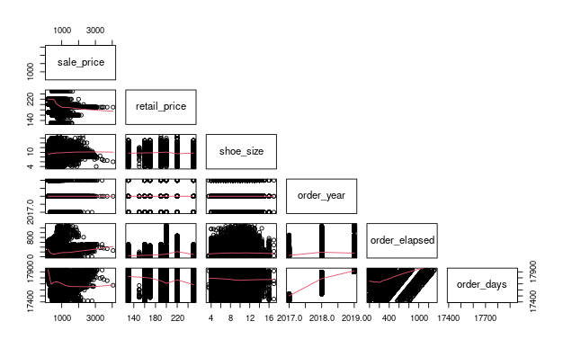

```{r setup, include=FALSE}
knitr::opts_chunk$set(echo=TRUE, message=FALSE, warning=FALSE)

library(tidyverse)
library(tidymodels)

library(ggplot2)
library(ISLR)
library(ISLR2)
library(corrplot)
library(poissonreg)
library(discrim)
library(klaR)
library(MASS)
library(purrr)
library(corrr) 
library(pROC)
library(recipes)
library(rsample)
library(parsnip)
library(workflows)
library(janitor)
library(glmnet)
library(rpart.plot)
library(vip)
library(randomForest)
library(xgboost)
library(ranger)
library(lubridate)
library(usmap)
library(maps)
library(here)
library(kknn)
library(vembedr)
tidymodels_prefer()
```

## Introduction

With origins dating back to the 1980's, a hobby that consisted of simply acquiring and trading sneakers (sneaker collecting), has become a global phenomenon. Commonly referred to ask Sneakerhead culture, the late 2010's saw an increase in interest for sneakers at both the low- and high-end of the fashion world. While online marketplaces like eBay and Facebook provided sneaker aficionados with a platform for buying and selling sneakers, the process of verifying the authenticity of sneaker (i.e. detecting fakes) was one of the main issues that plagued the Sneakerhead community.

`r embed_url("https://www.youtube.com/watch?v=w5vE1MeMcbA")`

The demand for authenticity verification gave rise to companies like StockX. StockX is a platform that allows users to buy and sell sneakers. Additionally, StockX acts as a middleman by verifying the authenticity of sneakers, and handling the transfer of funds. In the process, StockX generates revenue through a payment processing fee (3% of every sale) and regressive transaction fee (a fee that decreases as a reseller sells more shoes). Thus, StockX can theoretically increase their revenue greatly by identifying sneakers that will sell for high prices.

### The Task

The objective of this project is to develop models that can accurately predict sneaker prices from pre-determined predictors. This task can be best-viewed as a regression approach.

### Data Set Description
A sneaker sale data was published by StockX in February 2019 as part of their 2019 Data Contest; it can be downloaded [here](https://s3.amazonaws.com/stockx-sneaker-analysis/wp-content/uploads/2019/02/StockX-Data-Contest-2019-3.xlsx). The data set contains a random sample of all Off-White x Nike and Yeezy 350 sales from between the dates 9/1/2017 and 2/15/2019. Additionally, 99956 total sales are recorded: 27794 Off-White sales and 72162 Yeezy sales. The sample consists of U.S. sales only. The variables recorded for each sale are:

  * Order Date: The date of the sale.
  * Brand: The brand of the sneaker sold.
  * Sneaker Name: The name of the sneaker sold.
  * Sale Price: The price at which the sneaker was sold.
  * Retail Price: The original retail price of the sneaker.
  * Release Date: The date on which the sneaker was first available for purchase from retailers.
  * Shoe Size: The US size of the sneaker.
  * Buyer Region: The US region in which the buyer lived.

A detailed description of the data set can be found in the data/raw/stockx_sales_codebook.txt file.

## Data Cleaning and Processing
The initial step involves reading the data set provided by StockX, and importing the data processing functions.

```{r, eval=TRUE, indent="  "}
sales_raw = read_csv("data/raw/stockx_sales.csv")
source("scripts/data_processing.R")
```

The data set contains information about `r nrow(sales_raw)` sneaker sales. Additionally, the data set contains `r sum(is.na(sales_raw))` missing values. The following steps are performed to prepare the data set for exploratory data analysis and model training.

  1. Clean the data set column names.
```{r, eval=TRUE, indent="  "}
sales = sales_raw %>% clean_names()
```

  2. Convert the dollar-valued columns (sale_price and retail_price) to numeric-valued columns.
```{r, eval=TRUE, indent="  "}
sales = sales %>%
  mutate(sale_price=parse_dollar_values(sale_price)) %>%
  mutate(retail_price=parse_dollar_values(retail_price))
```

  3. Add the order_weekday column. This column denotes the day of the week on which the sale occurred.
```{r, eval=TRUE, indent="  "}
sales = sales %>% mutate(order_weekday=calculate_weekday(order_date))
```

  4. Add the order_day column. This column denotes the day of the month in which the sale occurred.
```{r, eval=TRUE, indent="  "}
sales = sales %>% mutate(order_day=calculate_day(order_date))
```

  5. Add the order_month column. This column denotes the month of the year in which the sale occurred.
```{r, eval=TRUE, indent="  "}
sales = sales %>% mutate(order_month=calculate_month(order_date))
```

  6. Add order_year column. This column denotes the year in which the sale occurred.
```{r, eval=TRUE, indent="  "}
sales = sales %>% mutate(order_year=calculate_year(order_date))
```

  7. Add the order_elapsed and order_days column. The former denotes the number of days that have passed between the release date and the order date. The latter denotes the number of days that have passed between January 1st, 1970 and the order date.
```{r, eval=TRUE, indent="  "}
sales = sales %>%
  mutate(order_elapsed=calculate_days_elapsed(order_date) -
           calculate_days_elapsed(release_date)) %>%
  mutate(order_days=calculate_days_elapsed(order_date))
```

  8. Convert the buyer_region column to lower case.
```{r, eval=TRUE, indent="  "}
sales = sales %>% mutate(buyer_region=tolower(buyer_region))
```

  9. Remove the leading white-space characters from the brand names.
```{r, eval=TRUE, indent="  "}
sales = sales %>% mutate(brand=wstrip(brand))
```

  10. Remove the order_date and release_date columns. Remove rows with negative order_elapsed values. Some sneakers were sold on StockX prior to their official release; these sneakers were likely made available through a pre-release event.
```{r, eval=TRUE, indent="  "}
sales = sales %>%
  select(-order_date, -release_date) %>%
  subset(order_elapsed >= 0)
```

  11. Save the processed data set to the "data/processed/stockx_sales.csv" file.
```{r, eval=TRUE, indent="  "}
write_csv(sales, here("data", "processed", "stockx_sales.csv"))
```

In summary, the data set has been transformed to track the following variables:

  * brand: The brand of the sneaker sold.
  * sneaker_name: The name of the sneaker sold.
  * sale_price: The price at which the sneaker was sold.
  * retail_price: The original retail price of the sneaker.
  * shoe_size: The US size of the sneaker.
  * order_weekday: The day of the week on which the sneaker was sold.
  * order_day: The day of the month on which the sneaker was sold.
  * order_month: The month of the year on which the sneaker was sold.
  * order_year: The year in which the sneaker was sold.
  * order_elapsed: The number of days that have passed between the release date and the order date.
  * order_days: The number of days that have passed between January 1st, 1970 and the order date.
  * buyer_region: The US region in which the buyer lived.

A detailed description of the processed data set can be found in the data/processed/stockx_sales_codebook.txt file.

## Exploratory Data Analysis
The initial step is to read the processed data set, and import the exploratory data analysis functions.

```{r, eval=TRUE, indent="  "}
source("scripts/eda.R")
source("scripts/utility.R")

sales = read_processed_data_set("data/processed/stockx_sales.csv")
```

The data set contains `r nrow(sales)` rows and `r ncol(sales)` columns. The data set does not contain any missing values.

### Distribution of Variables
A natural first step is to examine the distribution of recorded sale prices and potential predictor variables.

#### Sale Prices
The distribution of sale prices is skewed-right. In particular, a majority of sneakers were sold for less than \$600. Additionally, the minimum, median, and maximum of the sale prices are \$186, \$365, and \$4050, respectively.

```{r, eval=TRUE, warning=FALSE, indent="  "}
display_fivenum(sales$sale_price, "Sale Price")
display_histogram(sales$sale_price, "Distribution of Sale Prices", "Sale Price",
                  "Frequency")
```

#### Brands
When viewing sale prices of less than \$1000, sneakers were most frequently sold for approximately \$270; a majority of these sneakers were of the Yeezy brand. Additionally, there appears exist a correlation between brand of a sneaker and its sale price: Yeezy sneakers were typically sold at lower prices than Off-White sneakers. This correlation remains consistent when reviewing sale prices of at least \$1500. The difference in sale prices is likely a contributor to the stark difference in overall sales per brand. In particular, the data set consists of roughly 75\% Yeezy sneaker sales.
```{r, eval=TRUE, warning=FALSE, indent="  "}
display_counts_and_percentages(sales$brand, "Brand", "Sales")

sales %>%
  filter(sale_price<1000) %>%
  ggplot(aes(sale_price, fill=brand)) +
  geom_histogram(bins=40) +
  labs(title="Distribution of Sale Prices (Less Than $1000)", x="Sale Price",
       y="Frequency", fill="Brand")

sales %>%
  filter(sale_price>1500) %>%
  ggplot(aes(sale_price, fill=brand)) +
  geom_histogram(bins=40) +
  labs(title="Distribution of Sale Prices (Greater than $1500)", x="Sale Price",
       y="Frequency", fill="Brand")
```

#### Sneaker Names
Yeezy sneakers account for nine out of the Top 10 most sold sneakers. The only Off-White sneaker in the Top 10 accounts for just 2.67\% of all sales. Additionally, the Top 5 most sold sneakers account for slightly over 50\% of all sales.
```{r, eval=TRUE, indent="  "}
display_counts_and_percentages(sales$sneaker_name, "Sneaker Name", "Sales",
                               top_k=length(unique(sales$sneaker_name)))
```

#### Retail Prices
Recall that the sale price of Off-White sneakers is typically higher price than Yeezy sneakers. Despite this, the retail price of Off-White sneakers was typically lower than that of Yeezy sneakers. Additionally, there is a wider spread in the retail price of Off-White sneakers; the retail price of Yeezy sneakers is concentrated around \$210.
```{r, eval=TRUE, warning=FALSE, indent="  "}
sales %>%
  group_by(brand, sneaker_name) %>%
  summarise_at(vars(retail_price), list(price=mean)) %>%
  ggplot(aes(price, fill=brand)) +
  geom_histogram(bins=10) +
  labs(title="Distribution of Retail Prices", x="Retail Price",
       y="Frequency", fill="Brand")
```

#### Shoe Sizes
The size of most shoes sold, ranges from 9.0 through 11.0. The distribution appears to be somewhat normally distributed (with a slight left skew).
```{r, eval=TRUE, warning=FALSE, indent="  "}
sales %>%
  mutate(shoe_size = as.factor(shoe_size)) %>%
  group_by(brand, shoe_size) %>%
  summarise(counts=n()) %>%
  ggplot(aes(shoe_size, counts)) +
  geom_bar(stat="identity") +
  labs(title="Distribution of Shoe Sizes", x="Shoe Size", y="Frequency")
```

#### Sales Volume
Define sale volume as the number of sneaker sales that occurred within a predefined time period; note that this coincides with the definition of [trading volume](https://www.investopedia.com/terms/v/volume.asp).

The average volume is fairly consistent throughout a given month. However, there is an increase toward the end of the month. Additionally, there is an abrupt spike in average volume during the middle of the month. The end-of-month increase may be attributed to sellers cashing out. The average volume tends to be higher in the Summer and Winter. It is not surprising that the average monthly reaches a maximum in December (due to the holiday season).
```{r, eval=TRUE, warning=FALSE, indent="  "}
# Method: Calculates the sale date for a given row in the processed data set in
# dd-mm-yy format.
# data: The processed data set.
# k: The sale date of the k-th row will be calculated.
calculate_date = function(data, k){
  row = data[k,] %>%
    mutate(order_day=as.numeric(order_day)) %>%
    mutate(order_month=as.numeric(order_month)) %>%
    mutate(order_year=as.numeric(as.character(order_year)))
  
  return (as.Date(sprintf("%02d-%02d-%02d", row$order_day, row$order_month,
               row$order_year%%100), format="%d-%m-%y"))
}

start_date = calculate_date(sales, 1)
end_date = calculate_date(sales, nrow(sales))

counts = calculate_day_of_month_counts(start_date, end_date)
volume_averages = calculate_volume_averages_day_of_month(counts,
                                                         sales$order_day)
display_barplot(1:31, volume_averages, "Distribution of Average Daily Volume",
                "Day of Month", "Average Volume")

counts = calculate_month_counts(start_date, end_date)
volume_averages = calculate_volume_averages_month(counts, sales$order_month)
display_barplot(month.name, volume_averages,
                "Distribution of Average Monthly Volume", "Month",
                "Average Volume")
```

The earliest and latest recorded sales occurred on `r calculate_date(head(sales, 1))` and `r calculate_date(tail(sales, 1))`, respectively (in yyyy/mm/dd format). Thus, 2018 is the only complete year for which data exists. It is worth noting that more sales were recorded in 2019 than in 2017. This is notable as less dates were tracked in 2019 than in 2017. Additionally, the average monthly volume is greater in the last quarter of the year than in the first quarter. This may indicate that the annual sales volume increased between the years 2017 and 2019.
```{r, eval=TRUE, warning=FALSE, indent="  "}
display_counts_and_percentages(sales$order_year, "Year", "Sales")
```

The average volume per weekday remains fairly consistent throughout a given week. The average volume per weekday reaches a minimum and maximum on Sunday and Friday, respectively.
```{r, eval=TRUE, warning=FALSE, indent="  "}
days_of_week = c("Sunday", "Monday", "Tuesday", "Wednesday", "Thursday",
                 "Friday", "Saturday")

counts = calculate_wday_counts(start_date, end_date)
volume_averages = calculate_volume_averages_wday(counts, sales$order_weekday)
display_barplot(days_of_week, volume_averages,
                "Distribution of Average Volume Per Weekday", "Day of Week",
                "Average Volume")
```

#### Buyer Regions
There is a stark difference for each region with respect to overall sales volume. The Top 5 regions (California, New York, Oregon, Florida, Texas) account for over half of all sales volume. The inclusion of Oregon is notable as Oregon had only the 27th highest population in both 2010 and 2021 (according to the United States Census). It is also worth noting that each state in the [Mountain West region of the United States](https://en.wikipedia.org/wiki/Mountain_states) contributed less than 2\% to the overall sales volume.
```{r, eval=TRUE, warning=FALSE, indent="  "}
display_counts_and_percentages(sales$buyer_region, "Buyer Region", "Sales", 51)

volume_per_state = sales %>%
  group_by(buyer_region) %>%
  summarise(volume=n()) %>%
  arrange(desc(volume))
states = map_data("state") %>%
  clean_names() %>%
  rename(buyer_region=region) %>%
  left_join(y=volume_per_state, by="buyer_region")

ggplot() +
  geom_polygon(data=states,
               aes(x=long, y=lat, group=group, fill=volume),
               color="white", size = 0.5) +
  ggtitle("Sales Volume Per Region") +
  labs(x="Longitude", y="Latitude", fill="Sales")
```

#### Sale and Release Dates
The order_elapsed and order_days variables denote the number of days that have passed between the release date and the order date, and the number of days that have passed between January 1st, 1970 and the order date, respectively. A majority of the sneakers were sold approximately 50 days after their release date. Additionally, a majority of the sales occurred approximately 17900 days after January 1st, 1970; the approximate date is January 4th, 2019.

```{r, eval=TRUE, warning=FALSE, indent="  "}
display_histogram(sales$order_elapsed, "Days Elapsed Per Sale", "Days Elapsed",
                  "Frequency", bins=20)
display_histogram(sales$order_days, "Sales Per Day After January 1st, 1970", "Days After January 1st, 1970",
                  "Frequency", bins=20)
```

### Correlations
The correlation between the variables of the processed data set, are examined.

#### Numeric Variables
The correlation matrix between the numeric variables, sale_price, retail_price, shoe_size, order_year, order_elapsed, and order_days, is considered; the order_weekday, order_day, and order_month variables are omitted due to their cyclic nature. There is a strong correlation between the order_year and order_elapsed variables; this is logical as the order year increases as the number of days increases. The other variable pairs are weakly correlated at best. The (sale_price, retail_price) pair has a negative correlation. The low retail price and high sale price of the Off-White sneakers may be responsible for this.
```{r, eval=TRUE, indent="  "}
sales %>%
  select(sale_price, retail_price, shoe_size, order_year, order_elapsed,
         order_days) %>%
  mutate(order_year=as.numeric(as.character(order_year))) %>%
  cor(.) %>%
  corrplot(method="number", type="lower", order='alphabet', diag=FALSE)
```

Plotting a smooth regression curve for each of the aforementioned variables, shows that sale prices tend to increase over time. A limited quantity of each sneaker was released. As with any collectible, sneaker rarity increases over time. Thus, this observation is not surprising. Intuitively, there should exist a positive correlation between retail and sale prices. However, this is not the case. This may be a consequence of the resell market; the retail value of an object is irrelevant. The (sale_price, shoe_size) and (sale_price, order_year) pairs display a lack of correlation. Recall that less than two years worth of sales are included in the data set. A shoe size's rarity is expected to increase over time. Thus, the lack of correlation between sale price and shoe size is not abnormal. A analogous argument can be provided for the lack of correlation between sale price and order year. The rarity argument can be applied to justify the observation that the sale_price variable increases as the order_elapsed variable increases. There is a noticeable positive correlation between order_year and order_days as well.

```{r, eval=FALSE, indent="  "}
# sales %>%
#   select(sale_price, retail_price, shoe_size, order_year, order_elapsed,
#          order_days) %>%
#   mutate(order_year=as.numeric(as.character(order_year))) %>%
#   pairs(upper.panel=NULL, lower.panel=panel.smooth)
```


#### Sale Prices and Non-Numeric Predictors
The sale price of an Off-White sneaker exhibits greater variation than the sale price of a Yeezy sneaker. As mentioned previously, the Off-White sneakers tend to correspond to higher sale prices than Yeezy sneakers. 
```{r, eval=TRUE, indent="  "}
display_fivenum(sales$sale_price[sales$brand=="Off-White"],
                "Off-White Sale Price")
display_fivenum(sales$sale_price[sales$brand=="Yeezy"], "Yeezy Sale Price")

sales %>%
  ggplot(aes(x=brand, y=sale_price, fill=brand)) +
  geom_boxplot() +
  coord_flip() +
  labs(title="Sale Prices By Brand", x="Month", y="Sale Price", fill="Brand")
```

The Air-Jordan-1-Retro-High-Off-White-Chicago is the main contributor to the variation for the Off-White brand. This sneaker was sold `r count_occurrences(sales$sneaker_name, "Air-Jordan-1-Retro-High-Off-White-Chicago")` times. On the other hand, the Adidas-Yeezy-Boost-350-Low-Turtledove sneaker is the main factor for the variation for the Yeezy brand. This sneaker was sold `r count_occurrences(sales$sneaker_name, "Adidas-Yeezy-Boost-350-Low-Turtledove")` times.
```{r, eval=TRUE, indent="  "}
sales %>%
  ggplot(aes(x=sneaker_name, y=sale_price, fill=brand)) +
  geom_boxplot() +
  coord_flip() +
  labs(title="Sale Prices By Sneaker Name", x="Sneaker Name", y="Sale Price", fill="Brand")
```

The variation of sale prices remained consistent throughout a given week and month. However, the sale price spread varies depending on the month and year.
```{r, eval=TRUE, indent="  "}
sales %>%
  mutate(order_wday=wday(as.Date(sprintf("%02d-%02d-%02d", order_day,
                                         order_month,
                                         order_year%%100),
                                 format="%d-%m-%y"))) %>%
  ggplot(aes(x=reorder(order_weekday, -order_wday), y=sale_price, fill=brand)) +
  geom_boxplot() +
  coord_flip() +
  labs(title="Sale Prices By Day of Week", x="Day of Week", y="Sale Price", fill="Brand")

sales %>%
  mutate(order_day_chr=as.character(order_day)) %>%
  ggplot(aes(x=reorder(order_day_chr, order_day), y=sale_price)) +
  geom_boxplot() +
  coord_flip() +
  labs(title="Sale Prices By Day of Month", x="Day of Month", y="Sale Price")

sales %>%
  mutate(order_month_chr=month.name[month(as.Date(sprintf("%02d-%02d-%02d",
                                                          as.numeric(order_day),
                                                          as.numeric(order_month),
                                                          as.numeric(as.character(order_year))%%100),
                                                  format="%d-%m-%y"))]) %>%
  ggplot(aes(x=reorder(order_month_chr, order_month), y=sale_price,
             fill=brand)) +
  geom_boxplot() +
  coord_flip() +
  labs(title="Sale Prices By Month", x="Month", y="Sale Price", fill="Brand")

sales %>%
  mutate(order_year_chr=as.character(order_year)) %>%
  ggplot(aes(x=reorder(order_year_chr, order_year), y=sale_price, fill=brand)) +
  geom_boxplot() +
  coord_flip() +
  labs(title="Sale Prices By Year", x="Year", y="Sale Price", fill="Brand")
```

Sale prices are less volatile in the Summer and Winter (July and December, respectively). This trend may be related to the increased Summer and Winter sale volume. In the stock market, large sales volume is often inversely correlated with volatility. Though there are a myriad of factors that affect volatility in the stock market (e.g. earnings results, company news, etc.), a low number of bids and asks tends to be one of the main causes; a bid refers to the act of offering to buy an asset at a certain price, while an ask refers to the act of offering to sell an asset at a certain price. Volatility arises in this case as buyers either underpay or overpay for an asset. Since sales volume is limited by the number of bids and asks, it is expected that volatility and sales volume is inversely correlated. Unfortunately, the data set does not contain information regarding bids and asks; thus, this hypothesis cannot be verified.

Observe that there are a considerable number of outliers. Most of these outliers are greater than their corresponding box plot. This shows that buyers are willing to overpay for a sneaker; given the exclusivity of Yeezy and Off-White sneakers, this is not surprising.
```{r, eval=TRUE, indent="  "}
sales %>%
  mutate(order_month=sprintf("%02d", order_month)) %>%
  mutate(order_year=as.character(order_year)) %>%
  ggplot(aes(x=order_month, y=sale_price, fill=order_year)) +
  geom_boxplot() +
  coord_flip() +
  labs(title="Sale Prices By Month", x="Month", y="Sale Price", fill="Year")
```

Recall that the minimum, median, and maximum of the sale prices in the data set are \$186, \$370, and \$4050, respectively. Most regions have a considerable quantity of outliers. Despite this, the median of each buyer region lies approximately in the interval [\$300, \$420]. Thus, the buyer region does not affect the sale price.
```{r, eval=TRUE, indent="  "}
sales %>%
  arrange(desc(sale_price)) %>%
  group_by(buyer_region) %>%
  ggplot(aes(x=buyer_region, y=sale_price)) +
  geom_boxplot() +
  coord_flip() +
  labs(title="Sale Prices By Buyer Region", x="Buyer Region", y="Sale Price")

volume_per_state = sales %>%
  group_by(buyer_region) %>%
  summarise(volume=median(sale_price)) %>%
  arrange(desc(volume))
states = map_data("state") %>%
  clean_names() %>%
  rename(buyer_region=region) %>%
  left_join(y=volume_per_state, by="buyer_region")
ggplot() +
  geom_polygon(data=states,
               aes(x=long, y=lat, group=group, fill=volume),
               color="white", size = 0.5) +
  ggtitle("Sales Volume Per Region") +
  labs(title="Median Sale Price By Buyer Region", x="Longitude", y="Latitude",
       fill="Sales")
```

## Building Predictive Models
### Constructing Training and Testing Sets
The Exploratory Data Analysis suggests that the following variables should be utilized to predict the sale price of a sneaker:

  * brand: The brand of the sneaker sold.
  * sneaker_name: The name of the sneaker sold.
  * order_day: The day of the month on which the sneaker was sold.
  * order_month: The month of the year on which the sneaker was sold.
  * order_elapsed: The number of days that have passed between the release date and the order date.
  * order_days: The number of days that have passed between January 1st, 1970 and the order date.
  
Additionally, the variety of sales volume suggests that only the Top 15 Most Sold Sneakers should be considered. The data set is then written to the file "data/model/stockx_sales.csv".

```{r, eval=TRUE, indent="  "}
sales = read_processed_data_set("data/processed/stockx_sales.csv") %>%
  select(sale_price, brand, sneaker_name, order_day, order_month, order_elapsed,
         order_days)

most_sold_sneakers = sales %>%
  group_by(sneaker_name) %>%
  summarise(counts=n()) %>%
  arrange(desc(counts)) %>%
  slice(1:15)

sales = sales[sales$sneaker_name %in% most_sold_sneakers$sneaker_name,] %>%
  mutate(order_day=as.numeric(as.character(order_day))) %>%
  mutate(order_month=as.numeric(as.character(order_month))) %>%
  mutate(brand=as.factor(brand)) %>%
  mutate(sneaker_name=as.factor(sneaker_name))

write_csv(sales, here("data", "model", "stockx_sales.csv"))
```

The sales data set is split into a training set and testing set with a standard 70-30 split, respectively. Due to the considerable variety of sale prices, the split is stratified with respect to sale prices. This forces the proportions of the sale prices in the original data set, to be reflected in the training set.

Additionally, cross-validation is leveraged for parameter tuning. In particular, the data set is split into $k=10$ folds.
```{r, eval=TRUE, indent="  "}
sales = read_model_data_set("data/model/stockx_sales.csv")
sales_split = initial_split(sales, prop=0.70, strata=sale_price)

train_sales = training(sales_split)
test_sales = testing(sales_split)

folds = vfold_cv(train_sales, v=10)
```

The training and testing sets have `r nrow(train_sales)` and `r nrow(test_sales)` observations, respectively.

### Constructing The Recipe
The recipe is constructed by specifying the response variable (sale_price) and the predictor variables (brand, sneaker_name, order_day, order_month, order_elapsed, order_days). Dummy variables are created for the nominal predictor variables. The numeric predictors are centered and scaled.

```{r, eval=TRUE, indent="  "}
sales_recipe = recipe(sale_price ~ brand + sneaker_name + order_day +
                        order_month + order_elapsed + order_days,
                      data=train_sales) %>%
  step_dummy(all_nominal_predictors()) %>%
  step_normalize(all_numeric_predictors())
```

### Training Models
The objective of predicting the sale price of a sneaker is best-framed as a regression problem. Thus, repeated fold cross-validation is performed on three model types for addressing this task:

  * k-Nearest Neighbors
  * Random Forest
  * Boosted Trees

The regression mode is used for each model. The model training functions are imported. All models are saved to a file in the "models" folder. Each model type required approximately 45 to 75 minutes to tune.

```{r, eval=TRUE, indent="  "}
source("scripts/training.R")
```

#### k-Nearest Neighbors
Only the neighbors parameter is tuned; five levels are considered for this parameter.

```{r, eval=TRUE, indent="  "}
model_knn = nearest_neighbor(neighbors=tune()) %>%
  set_engine("kknn") %>%
  set_mode("regression")

wkflow_knn = workflow() %>%
  add_model(model_knn) %>%
  add_recipe(sales_recipe)

params_knn = parameters(model_knn)
grid_knn = grid_regular(params_knn, levels=5)

# tune_and_save(wkflow_knn, folds, grid_knn, "models/knn.Rds")
```

#### Random Forest
The mtry, and min_n parameters are tuned. Unfortunately, the tuning process for this model is computationally expensive; the data set size is a significant contributing factor. Recall that the six predictor variables are being considered. Thus, the parameters mtry and and min_n are considered to be in the intervals [1, 3] and [1, 15], respectively. With additional computing resources, a deeper experimentation can be performed with the values of the parameters.

```{r, eval=TRUE, indent="  "}
model_rforest = rand_forest(mtry=tune(), min_n=tune()) %>%
  set_engine("ranger") %>%
  set_mode("regression")

wkflow_rforest = workflow() %>%
  add_model(model_rforest) %>%
  add_recipe(sales_recipe)

params_rforest = parameters(model_rforest) %>%
  update(mtry=mtry(range=c(2, 4)))
grid_rforest = grid_regular(params_rforest, levels=2)

# tune_and_save(wkflow_rforest, folds, grid_rforest, "models/rforest.Rds")
```

#### Boosted Trees
The trees parameter is tuned for the boosted tree model; five levels are considered for this parameter on the interval [20, 1000].

```{r, eval=TRUE, indent="  "}
model_boost = boost_tree(trees=tune()) %>%
  set_engine("xgboost") %>%
  set_mode("regression")

wkflow_boost = workflow() %>%
  add_model(model_boost) %>%
  add_recipe(sales_recipe)

params_boost = parameters(model_boost) %>%
  update(trees=trees(range=c(20, 1000)))
grid_boost = grid_regular(params_boost, levels=5)

# tune_and_save(wkflow_boost, folds, grid_boost, "models/boost.Rds")
```

### Evaluating Model Performance
The aforementioned models are loaded. The RMSE metric is used to analyze the performance of the models.

```{r, eval=TRUE, indent="  "}
tuned_knn = readRDS(("models/knn.Rds"))
tuned_rforest = readRDS(("models/rforest.Rds"))
tuned_boost = readRDS(("models/boost.Rds"))
```

#### k-Nearest Neighbors
The RMSE appears to decrease as the number of neighbors increases. In particular, setting the neighbors parameter to 15 leads to a mean RMSE of approximately \$42. This is a solid approximation considering that most sneakers sale prices are of the magnitude of hundreds of dollars.

```{r, eval=TRUE, indent="  "}
autoplot(tuned_knn, metric = "rmse")
show_best(tuned_knn, metric = "rmse") %>%
  select(-.metric, -.estimator, -.config, -n)
```

#### Random Forest
The RMSE appears to decrease as the number of randomly selected parameters, decreases. In particular, setting this parameter equal to 4 leads to a mean RMSE of approximately \$47 (regardless of choice of min_n). Like for the k-Nearest Neighbors model, this is a solid approximation. It would be ideal to consider more parameter combinations though.

```{r, eval=TRUE, indent="  "}
autoplot(tuned_rforest, metric = "rmse")
show_best(tuned_rforest, metric = "rmse") %>%
  select(-.metric, -.estimator, -.config, -n)
```

#### Boosted Trees
The RMSE appears to increase as the number of trees increases. In particular, setting this parameter equal to 20 leads to a mean RMSE of approximately \$39. Thus, this model outperforms the other two models.

```{r, eval=TRUE, indent="  "}
autoplot(tuned_boost, metric = "rmse")
show_best(tuned_boost, metric = "rmse") %>%
  select(-.metric, -.estimator, -.config, -n)
```

### The Best Model
The best model with respect to the RMSE metric, is the Boosted Tree model. This model is fit to the original training set.
```{r, eval=TRUE, indent="  "}
wkflow_best = wkflow_boost %>%
  finalize_workflow(select_best(tuned_boost, metric="rmse"))

model_fit = fit(wkflow_best, train_sales)
```

An RMSE of approximately \$37 is obtained when applying the fit model to the testing set. This is fairly close to the mean RMSE obtained during the tuning process. Therefore, the model did not overfit with respect to the training data.

```{r, eval=TRUE, indent="  "}
metric_best = metric_set(rmse)
predictions_best = predict(model_fit, new_data=test_sales) %>%
  bind_cols(test_sales %>% select(sale_price, brand, sneaker_name))

predictions_best %>%
  metric_best(estimate=.pred, truth=sale_price)
```

Consider the sneakers whose absolute difference between predicted and actual sale price, is at least $m = 2 \times RMSE_{test} \approx 75$; these predictions are referred to as Abnormal Predictions. Considering the sales volume per brand, the Off-White sneakers (specifically Air-Jordan-1-Retro-High-Off-White-University-Blue) are responsible for the greatest number of abnormal predictions; this is not abnormal as this sneaker had the most sales out of all Off-White sneakers. The Adidas-Yeezy-Boost-350-V2-Semi-Frozen-Yellow contributes the most abnormal predictions for the Yeezy brand. However, this quantity accounts for less than 3\% of all of this sneaker's sales.

```{r, eval=TRUE, indent="  "}
min_threshold = 2*37.72046

predictions_best %>%
  mutate(difference=abs(sale_price-.pred)) %>%
  filter(difference>=min_threshold) %>%
  ggplot(aes(x=sale_price, y=.pred)) +
  geom_abline(lty=2) +
  geom_point(alpha=1) +
  # Scale and size the x- and y-axis uniformly:
  coord_obs_pred() +
  facet_wrap(~brand) +
  labs(
    title = "Predictions of Sale vs. Actual Sale Price",
    subtitle = "Greater than 75 Dollar Absolute Difference",
    y = "Predicted Sale Price",
    x = "Actual Sale Price"
  )

predictions_best %>%
  mutate(difference=abs(sale_price-.pred)) %>%
  filter(difference>=min_threshold) %>%
  group_by(brand) %>%
  summarise(counts=n()) %>%
  arrange(desc(counts)) %>%
  rename("Brand"=brand) %>%
  rename("Abnormal Predictions"=counts)

predictions_best %>%
  mutate(difference=abs(sale_price-.pred)) %>%
  filter(difference>=min_threshold) %>%
  group_by(sneaker_name) %>%
  summarise(counts=n()) %>%
  arrange(desc(counts)) %>%
  rename("Sneaker Name"=sneaker_name) %>%
  rename("Abnormal Predictions"=counts)

display_counts_and_percentages(sales$sneaker_name, "Sneaker Name", "Sales", 15)
```

## Conclusion

Three models (k-Nearest Neighbors, Random Forest, Boosted Trees) were considered for the task of predicting the sale price of Off-White and Yeezy brand sneakers; the models leveraged the predictors sale_price, brand, sneaker_name, order_day, order_month, order_elapsed, and order_days to estimate a sale price. Ultimately, the Boosted Tree model obtained an RMSE of just under \$40. Given the magnitude and variety of sale prices, this error is impressive.

By the Exploratory Data Analysis, it was determined that sneakers sale prices could be roughly partitioned by their brand; in particular, Yeezy sneakers typically sold for less than Off-White sneakers. Due to this, I thought that k-Nearest Neighbors would excel above the other models. However, the significant presence of outliers (sale prices) may have prevented this from being the case.

Though the error obtained is satisfactory for an initial attempt, one possible strategy for improving predictions is to view the data as a time series. Intuitively, viewing sales sequentially and factoring temporal patterns should allow a model to obtain more accurate estimates. Unfortunately, this approach is beyond the scope of this class.

Though training on more data does not always lead to improved results, a future iteration of this project would likely benefit it. There are three variables that should be considered: sneaker color, bid price, and ask price. Sneakers can exist in virtually any color. However, there appears to be a trend among the best selling sneakers. For example, [the Top 10 Best-Selling Sneakers on StockX](https://www.grailify.com/en/the-10-best-selling-sneakers-on-stockx/) shows that the market has an affinity for sneakers of certain colors (e.g. black, brown, white). It would not be surprising that the demand for a certain-colored sneaker, would play an integral role in the sneaker's price.

A bid price refers to the price that a buyer is willing to pay for a certain sneaker. A bid price refers to the price that a seller is willing to receive for a certain sneaker. This information would be particularly useful if it became known whether a bid or ask was actually converted into a sale. A failure to convert a bid would indicate that sellers are unwilling to sell a sneaker for a proposed price, i.e. the sneaker is worth more. Similarly, a failure to convert an ask would indicate that the market believes that a sneaker is worth less than the proposed amount. Tracking this information in a sequential manner would allow one to develop a real-time approximation of a sneaker's worth.

Having access to user information (e.g. sneakers bount/sold, sneakers viewed, etc.) also gives way to a natural application of sale price prediction. Given StockX's revenue model, it is in StockX's interest to convert bids and asks into sales. User preferences allow StockX to identify sneakers that a user may be interested in. By leveraging a sale price prediction feature, StockX would be able to prune the recommendation search-space by identifying sneakers that a user would be willing to pay for. This would allow StockX to increase their bid/ask conversion rate.

Recommendation search-space pruning is a natural extension of sale price prediction. However, entities outside of StockX would benefit from a sale price prediction tool. For example, resellers would derive considerable value from such a tool. Identifying sneakers that are expected to resell for high values based on historical data, would allow them to identify the best sneakers to purchase. Ultimately, the analysis and results presented in this paper provide a solid foundation for future research and applications of sneaker sale price prediction.
